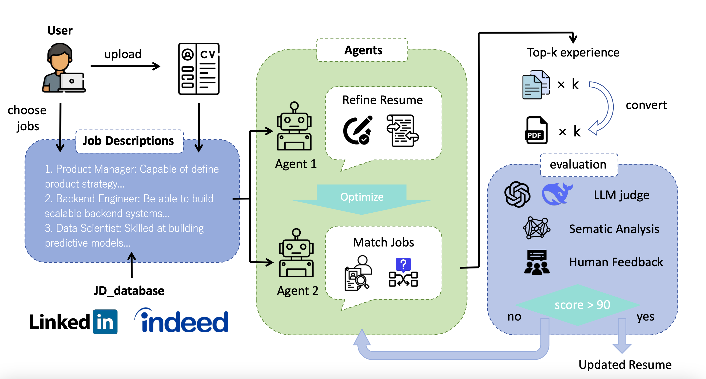

# JobForce.AI

*A Large-Language-Model career assistant for automated résumé optimization and personalized job matching*

------

## Abstract

The job application landscape is especially challenging for students and job seekers with limited time and energy, who are often interested in multiple positions but must manually tailor their resumes for each opportunity. JobForce.AI addresses these challenges by introducing a unified, LLM-driven pipeline that automates resume optimization and job matching across diverse roles. The system parses user-uploaded resumes into structured data and retrieves representative job descriptions via semantic embedding from a curated database. Large language models then perform context-sensitive rewriting of each experience, ensuring professional articulation and relevance to each target position. A ranking mechanism, based on normalized cosine similarity scores, condenses the rewritten content into concise, focused resumes for every selected job. Finally, the optimized resumes are embedded and compared against real-time, user-filtered job postings to generate the top ten most relevant recommendations per target. A built-in evaluation module quantifies alignment improvements, while an intuitive web interface provides real-time feedback and one-click export. JobForce.AI streamlines the early phases of the job search, delivering scalable, personalized career assistance for candidates pursuing multiple career tracks.

## Problem Statement

The job application process is labor-intensive and fragmented, requiring candidates to manually tailor their resumes for each position. Generic feedback tools often fail to address the nuanced expectations of hiring managers, making it difficult for job seekers to professionalize their language, prioritize relevant experiences, and highlight transferable skills—especially when targeting multiple or cross-industry roles. While Large Language Models (LLMs) offer promise for automating resume refinement, key challenges remain in aligning content with job descriptions, preserving user authenticity, and objectively evaluating optimization quality.

JobForce.AI leverages LLMs, vector embeddings, and a modular multi-agent architecture to automate résumé enhancement and evidence-based job recommendation, thereby improving both **effectiveness** (content quality) and **efficiency** (search latency).

## System Overview



| Module        | Functionality                                                                 | Key Techniques         |
| ------------- | ----------------------------------------------------------------------------- | ---------------------- |
| JD Retrieval  | Filter and rank job descriptions by keywords and semantic similarity          | FAISS, SentenceTransformer |
| Agent1        | Rewrite and tailor resume for each selected job using Prompt Engineering, Few Shot Training | OpenAI GPT API, Prompt Engineering |
| Agent2        | Select and rank relevant experiences, generate Markdown resume                | SentenceTransformer, FAISS, Markdown Generation |
| Agent3        | Convert Markdown to LaTeX/PDF, evaluate with LLM and semantic analysis        | LaTeX, pdflatex, OpenAI GPT API, Semantic Analysis |


## Dataset

- **GitHub JD Corpus** – ~3 k curated job-description JSONs spanning SDE, Data Science, Finance, Product, UX
- **Live Job Feed** – continuous web-scraping (Indeed, LinkedIn, Lever) with daily refresh


## Folder Descriptions

- **Agent1/**  
  Handles AI-powered resume rewriting and job description matching. Outputs a tailored JSON resume for each selected job position.
- **agent2/**  
  Integrates, scores, and selects the most relevant resume experiences for each job description, generating a concise Markdown resume tailored to each target position.
- **markdown2pdf/**  
  Converts Markdown/JSON resumes to LaTeX and then to PDF using pdflatex.
- **agent3_output/**  
  Stores intermediate LaTeX and PDF files generated during the pipeline.
- **final_resumes/**  
  Stores the final Markdown resumes.
- **frontend/**  
  Next.js web application for user input, job selection, preview, and PDF download.
- **requirements.txt**  
  Python backend dependency list.
- **package.json**  
  Frontend dependency list.

---

## Quick Start Demo
[](https://youtu.be/2kmPeE6X_gQ)


### 1. Install Dependencies

#### Python Backend
```bash
pip install -r requirements.txt
```

#### Node.js Frontend
```bash
cd frontend
npm install
```

### 2. Start the Frontend Development Server

```bash
cd frontend
npm run dev
```
- The app will be available at [http://localhost:3000](http://localhost:3000).

### 3. Run the Demo

1. In your terminal, click the URL http://localhost:3000 to open the app
2. Select target job positions and fill in your resume information.
3. Click "Finish" to trigger the backend pipeline.
4. On the preview page, download your AI-optimized, position-specific PDF resumes.

---

## Evaluation Protocol

| Aspect             | Metric                               | Method                      |
| ------------------ | ------------------------------------ | --------------------------- |
| Résumé quality     | Keyword coverage; LLM-based rubric   | TF-IDF, GPT-4 judge         |
| Matching stability | Consistency (same résumé → same *k*) | Repeated trials, Jaccard@10 |
| Latency            | Module-level wall-clock (ms)         | Python `time.perf_counter`  |


## Citation

If this repository contributes to your research, please cite:

```bibtex
@misc{jobforce2025,
  title   = {JobForce.AI: LLM-powered Résumé Optimization and Job Matching},
  author  = {You, Yiya and Dou, Kairan and Tang, Mingxi and Yan, Yufeng},
  year    = {2025},
  url     = {https://github.com/tangmingxi666/JobForce-AI-CS294}
}
```


## Contributors
- Mingxi Tang
- Yiya You
- Yufeng Yan
- Kairan Dou
---

## Acknowledgements
We thank the Berkeley Advanced LLM Agents MOOC faculty for guidance and the open-source communities behind OpenAI, LangChain, FAISS, and Pinecone.


